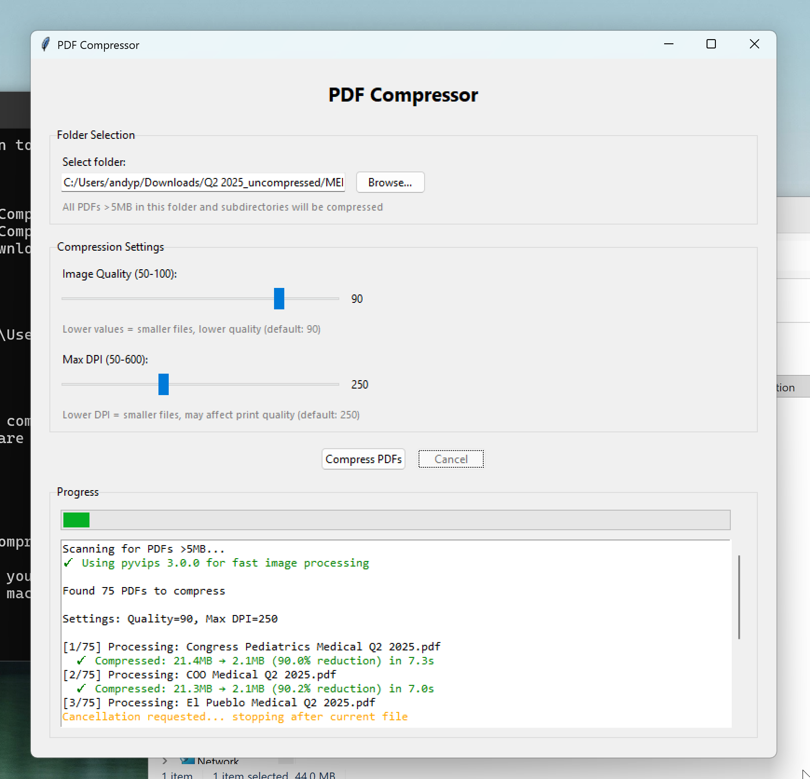

# PDF Compressor Desktop Tool

A desktop application to compress PDF files before uploading to file sharing platforms.

[](https://www.gnu.org/licenses/agpl-3.0)



## For Team Members (Using the Tool)

### Quick Start

The pre-built executable is included in this repository at releases.

### What This Tool Does

- Compresses all PDFs larger than 5MB in a selected folder
- Processes all subdirectories automatically
- Reduces file sizes by 85-95% on average
- Replaces original files only if compression helps
- No internet connection required - runs completely offline

### How to Use

1. **Run** `PDF_Compressor.exe` from the repository folder (or copy it anywhere on your computer)
2. **Double-click** to open the application
3. **Click "Browse..."** to select the folder containing your PDFs
4. **Adjust settings** (optional):
   - Image Quality: 50-100 (default: 90)
     - Lower = smaller files, slightly lower quality
   - Max DPI: 50-600 (default: 250)
     - Lower = smaller files, may affect print quality
5. **Click "Compress PDFs"** and wait for completion
6. **View results** in the progress window

### Expected Performance

- Typical compression: 85-95% size reduction
- Example: 1GB folder → ~100MB after compression

### Safety Features

- Only processes PDFs larger than 5MB
- Original files are kept if compression doesn't help
- Failed compressions leave originals untouched
- Files are compressed in-place (no separate output folder)

### Security Notice

This tool is designed to process trusted PDF files. Only use it with PDFs from trusted sources, as it processes embedded images without sandbox restrictions.

**Path Restrictions:**
For safety, the tool prevents processing files in:

**Completely Blocked (including subfolders):**

- System directories: `C:\Windows`, `C:\Program Files`, `C:\ProgramData`
- System binaries: `/usr`, `/bin`, `/sbin`, `/etc`, `/var`
- User data: `AppData`, `$Recycle.Bin`
- Drive roots: `C:\`, `D:\`, etc.

**Root Only Blocked (subfolders allowed):**

- User home directory: `C:\Users\YourName`
- Common folders: `Desktop`, `Documents`, `Downloads`, `Pictures`, `Music`, `Videos`
- OneDrive roots: `OneDrive`, `OneDrive - Personal`, `OneDrive - CompanyName`

**Examples:**

- ❌ Blocked: `C:\Users\YourName\Downloads`
- ✅ Allowed: `C:\Users\YourName\Downloads\Q2_2025_Reports`
- ❌ Blocked: `OneDrive - CompanyName`
- ✅ Allowed: `OneDrive - CompanyName\ClientProjects\ACME`

### File Verification (tag 0.0.1 for exe)

**SHA256 Hash:**

```
80f747cfcd0b293352a4d8f3e7b554a9e4501da56c0de65b3cae44634e270ff2
```

**MD5 Hash:**

```
4a63878c5d2295b85753d6fe79c86758
```

**Note:** Hash values change with each rebuild. Check the latest release for current hashes.

### Troubleshooting

**Windows SmartScreen Warning**

- Windows may show "Windows protected your PC" when first running the app
- This is normal for unsigned executables
- Click **"More info"** then **"Run anyway"** to proceed
- The app is safe - it's built from this open-source code

**"No PDF files >5MB found"**

- Make sure your folder contains PDFs larger than 5MB
- Check that you selected the correct folder

**Application won't start**

- Make sure you're running on Windows 10 or later
- Try running as Administrator (right-click → Run as administrator)

**Compression seems slow**

- This is normal for large files or many files
- You can leave it running in the background
- Typical: 5-10 seconds per 20MB file

---

## For Developers (Building the Tool)

### Prerequisites

- Python 3.12+
- [uv](https://github.com/astral-sh/uv) package manager
- Windows (for building Windows .exe) or macOS/Linux

Note: All dependencies including libvips binaries are automatically installed via `pyvips-binary` when you run `uv sync`.

### Building the Executable

1. Clone this repository
2. Run the build script:

   **Windows:**

   ```bash
   build.bat
   ```

   **macOS/Linux:**

   ```bash
   ./build.sh
   ```

3. The executable will be created in `dist/PDF_Compressor.exe` (Windows) or `dist/PDF_Compressor` (macOS/Linux)

### Manual Build Steps

If you prefer to build manually:

```bash
uv sync

uv run pyinstaller --onefile --windowed --name="PDF_Compressor" \
    --add-data="pdf_compress.py:." \
    --collect-binaries=pyvips \
    --hidden-import=pyvips \
    --hidden-import=PIL \
    --hidden-import=fitz \
    app.py
```

Note: On Windows, use `;` instead of `:` in `--add-data` parameter.

### Distribution

After building:

1. The .exe is in `dist/PDF_Compressor.exe`
2. This file is completely standalone - no dependencies needed
3. Distribute this single .exe file to team members
4. Team members do NOT need Python installed

### File Structure

```
pdf-compression/
├── src/
│   ├── main.py                    # Application entry point
│   ├── gui/
│   │   ├── app.py                 # Main GUI application
│   │   └── path_validator.py     # Path restriction logic
│   └── compression/
│       ├── pdf_processor.py       # PDF compression functions
│       └── image_optimizer.py     # Image optimization (pyvips/PIL)
├── pyproject.toml                 # Python project configuration
├── uv.lock                        # Locked dependencies
├── build.bat                      # Windows build script
├── build.sh                       # macOS/Linux build script
├── get_hashes.bat                 # Generate file hashes (Windows)
├── get_hashes.sh                  # Generate file hashes (macOS/Linux)
├── .gitignore                     # Git ignore rules
├── LICENSE                        # AGPL-3.0 license
└── README.md                      # This file
```

### Performance Notes

- Uses pyvips for fast image processing (3-5x faster than PIL)
- Typical processing time: 5-10 seconds per 20MB PDF
- Processes one file at a time (no concurrent processing in desktop version)
- Compression time depends on:
  - File size
  - Number of images in PDF
  - Image resolution and complexity
  - CPU speed

### Development Workflow

To test changes locally:

```bash
uv run python -m src.main
```

To rebuild after making changes:

1. Update the code in `src/` directory
2. Rebuild the executable:
   ```bash
   build.bat          # Windows
   ./build.sh         # macOS/Linux
   ```
3. Generate new file hashes:
   ```bash
   get_hashes.bat     # Windows
   ./get_hashes.sh    # macOS/Linux
   ```
4. Update the README with the new hashes (if needed for IT approval)
5. Distribute the new executable to team members

### Known Limitations

- Single-threaded (processes one PDF at a time)
- Platform-specific builds (Windows .exe must be built on Windows, macOS app on macOS, etc.)

---

## License

This project is licensed under the **GNU Affero General Public License v3.0** (AGPL-3.0).

This license is required due to the use of [PyMuPDF](https://github.com/pymupdf/PyMuPDF), which is licensed under AGPL-3.0.

### What this means:

- ✅ You can use, modify, and distribute this software freely
- ✅ Source code is publicly available
- ⚠️ If you modify and distribute it, you must share your modifications under the same license
- ⚠️ If you use it in a network service, you must make the source available to users

See the [LICENSE](LICENSE) file for full details.

### Third-Party Licenses

This project uses the following open-source libraries:

- **PyMuPDF** (AGPL-3.0) - PDF processing
- **Pillow** (HPND) - Image processing
- **pyvips** (MIT) - Fast image processing
- **PyInstaller** (GPL with exception) - Executable bundling
